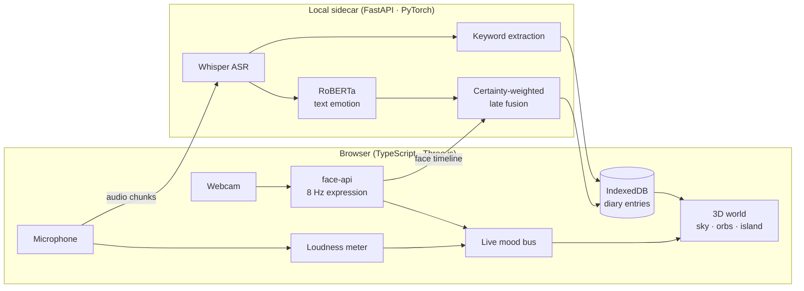

# An emotional diary that builds a 3D world

**Talk about your day. This reads how you felt from your face, voice and
words, and grows a persistent 3D world out of it, one memory at a time.**

A multimodal affective-computing system built for the *Affective Computing*
course at the University of Oulu. It is a real-time web app and also a research
project: every modelling decision is measured, including the ones that failed.

`TypeScript` · `Three.js` · `WebGL/GLSL` · `Python` · `FastAPI` · `PyTorch` ·
`Hugging Face Transformers` · `Whisper` · `ONNX` · `scikit-learn` · `IndexedDB`

---

## Highlights

- **Text emotion model at or above published baselines.** A fine-tuned
  RoBERTa reaches **0.629 weighted-F1 on MELD test**. The MELD paper's own
  text-only baselines sit at 0.55–0.57.
- **Real-time and fully local.** Face analysis runs in the browser at 8 Hz.
  Speech is transcribed by Whisper on your own machine at **0.17× real-time on
  CPU**, and words appear about 3.5 s after you say them. No cloud service ever
  sees your data.
- **A negative result that changed the product.** I tested whether fusing face,
  voice and text beats text alone, on two corpora (MELD and CMU-MOSI) and with
  five fusion strategies. It does not. I changed the shipped fusion weights
  based on that evidence instead of keeping the design I had started with.
- **Found a silent production bug in a popular model.** The default
  speech-emotion checkpoint had been loading with a **randomly initialised
  classifier head**, and the library only printed a warning. I diagnosed it,
  added a load guard that refuses broken checkpoints, and measured a working
  replacement.
- **Privacy is part of the architecture.** Video never leaves the page, the
  backend is stateless, and diary entries live only in the browser. The report
  for a doctor is also rendered client-side.
- **Responsible design for a sensitive domain.** The report for a clinician
  quotes what was said and never produces a risk score, because a false negative
  from a face model should not reassure anyone.

---

## What it does

Press **Talk about your day** and speak. Three things happen at different speeds:

| Layer | Latency | What runs | Where |
|---|---|---|---|
| Live | ~1 frame | facial expression, vocal energy | browser |
| Streamed | ~3.5 s | transcription, text emotion, keywords | local Python sidecar |
| Commit | on stop | full re-analysis, entry saved | local Python sidecar |

- **The sky** shows your live emotional state as a flowing field of colour
  (a custom GLSL shader). It shows emotions as separate colours rather than
  blending them into mud, and it fades towards grey when the model is unsure.
- **Each entry becomes a memory orb** in a permanent galaxy that is never reset.
  An entry with a genuine mix of emotions gets a two-toned orb. An orb's size and
  glow show how loudly you spoke, ranked against your own history so the result
  doesn't depend on your microphone.
- **The island above is built from what you talk about.** Recurring topics
  decide whether your world is a forest, a coastline or a room full of books.
  Core memories are linked to it by glowing threads.
- **History and export** show day, week and month views, a JSON backup, and a
  printable summary for a clinician.

---

## Architecture



All channels use the same **seven-class taxonomy from MELD** (neutral, joy,
sadness, anger, fear, disgust, surprise), so the fused result is a proper
combination of the same categories.

---

## Research results

### 1. Text: the gap was the domain, not model capacity

I ran controlled experiments that each changed one variable, and evaluated on
MELD test and on a separate probe set of 47 diary-style sentences.

| Run | Training data | Model | MELD wF1 | Diary accuracy |
|---|---|---|---|---|
| A | MELD | DistilRoBERTa | 0.578 | 0.532 |
| B | MELD | RoBERTa-base | 0.604 | 0.574 |
| C | + GoEmotions + DailyDialog | RoBERTa-base | 0.607 | **0.617** |
| **E (shipped)** | + tweets, capped per class | RoBERTa-base | **0.629** | — |

Adding 50k out-of-domain examples (B → C) left the MELD score almost unchanged
(+0.003) but raised diary accuracy by **4.3 points**. This shows the remaining
error came from the difference between sitcom dialogue and diary writing, not
from model size. Techniques used: class-weighted loss, dialogue context, label
mapping across corpora, and ensembling with a general-domain model.

### 2. Multimodal fusion does not beat the best single channel

| | MELD test wF1 | CMU-MOSI test wF1 |
|---|---|---|
| **Text alone** | **0.622** | **0.758** |
| Text + face | 0.611 | 0.712 |
| Text + face + voice | 0.601 | 0.657 |

<sub>All rows are calibrated on the dev split, so text alone scores slightly below the 0.629 headline.</sub>

On CMU-MOSI (close-up monologues, similar to a webcam diary) the face channel
does carry real signal, and per-clip oracle selection shows **+11 points of
complementary information**. Even so, none of the five combiners I tested
(fixed-weight, oracle-weighted, logistic regression, MLP, random forest)
recovered more than about 10% of that gain. As a result the shipped fusion
weights moved from 0.5 / 0.3 / 0.2 to **0.8 / 0.15 / 0.05**.

### 3. Diagnosing why the face and voice channels fail

- **Face size is the problem, not the model.** face-api detects a face in only
  48.5% of MELD frames, compared with **99.4% on CMU-MOSI**. A detector sweep
  shows a sharp drop in detection once a face is narrower than 15–20% of the
  frame, which is where MELD's wide TV shots sit. A person at a laptop fills
  25–40% of the frame.
- **I trained a replacement face head** (MobileNetV2 on MELD video, exported to
  ONNX) and **decided not to ship it**: it won on weighted-F1 but lost on
  macro-F1, the metric that matters when rare emotions must not be overlooked.
- **The voice fallback carried no signal** (ROC-AUC 0.474) but was confidently
  neutral, so certainty weighting was rewarding it. It was removed from fusion.
  The orbs now show measured loudness instead of an inferred emotion, because a
  loudness meter cannot be confidently wrong.

---

## Engineering highlights

- **Two bugs that failed silently.** Besides the random-head checkpoint, the
  text model was losing about half its confidence because it was trained with
  dialogue context and served without it. Both are now caught in code.
- **Calibration as a first-class metric.** Fusion weights each channel by its
  own certainty, so a badly calibrated model gains influence it has not earned.
  I report ECE and fitted temperatures for every channel.
- **Stable, reproducible world.** Orb positions are a pure function of an index
  stored on each entry, so changing the layout later never moves an existing
  memory.
- **A reliable clinician report.** PDF export is rendered in the browser to keep
  the privacy guarantee. I fixed a print-lifecycle race in which `afterprint`
  fired before its listener was attached, which duplicated the report.
- **Honest statistics.** Each derived figure states its sample size and is left
  out below a minimum (for example, a trend needs 7 recorded days).

---

## Run it

```powershell
.\run.ps1            # starts the sidecar, warms the models, opens the app
```

<details>
<summary>First-time setup</summary>

```powershell
cd frontend
npm install
npm run fetch-models

cd ..\backend
python -m venv .venv
.venv\Scripts\python.exe -m pip install --index-url https://download.pytorch.org/whl/cpu torch
.venv\Scripts\python.exe -m pip install -r requirements.txt
```

The app must be opened on `localhost`, because camera access requires a secure
context. `-NoBackend` runs the face channel only; `-Gpu` uses CUDA. Training
and evaluation commands are in [docs/RESEARCH.md](docs/RESEARCH.md).
</details>

---

## Project structure

```
frontend/src/
  capture/     webcam, microphone and session orchestration (live → streamed → commit)
  world/       Three.js scene: sky shader, memory orbs, terrain, biomes, water
  state/       IndexedDB storage, history roll-ups, clinician report
backend/app/   FastAPI sidecar: Whisper ASR, text model, fusion, keywords
backend/training/
               data preparation, training, and every evaluation cited above
```

## Limitations

- The **voice emotion model is not enabled.** A working replacement has been
  measured but needs calibration on real diary audio first.
- **Fear and disgust** remain hard for every model tested, because they are
  rare in the training data.
- The diary probe set is small (47 sentences) and I wrote it myself. It is a
  diagnostic tool, not a benchmark.

---

**Full research log**, including every ablation, calibration table and design
rationale: **[docs/RESEARCH.md](docs/RESEARCH.md)**
